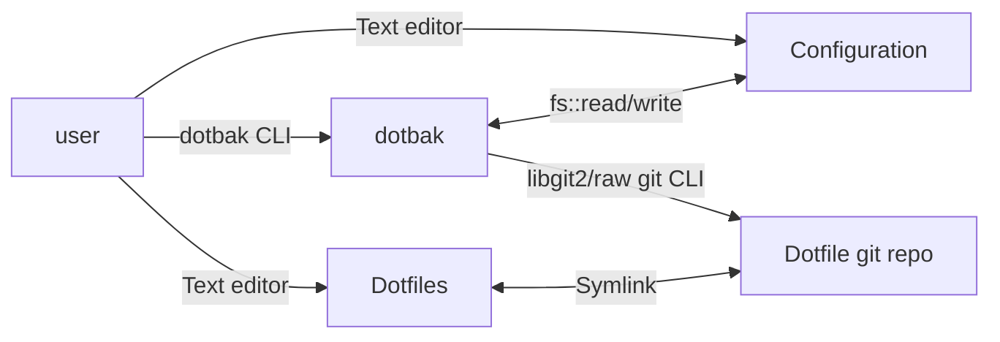
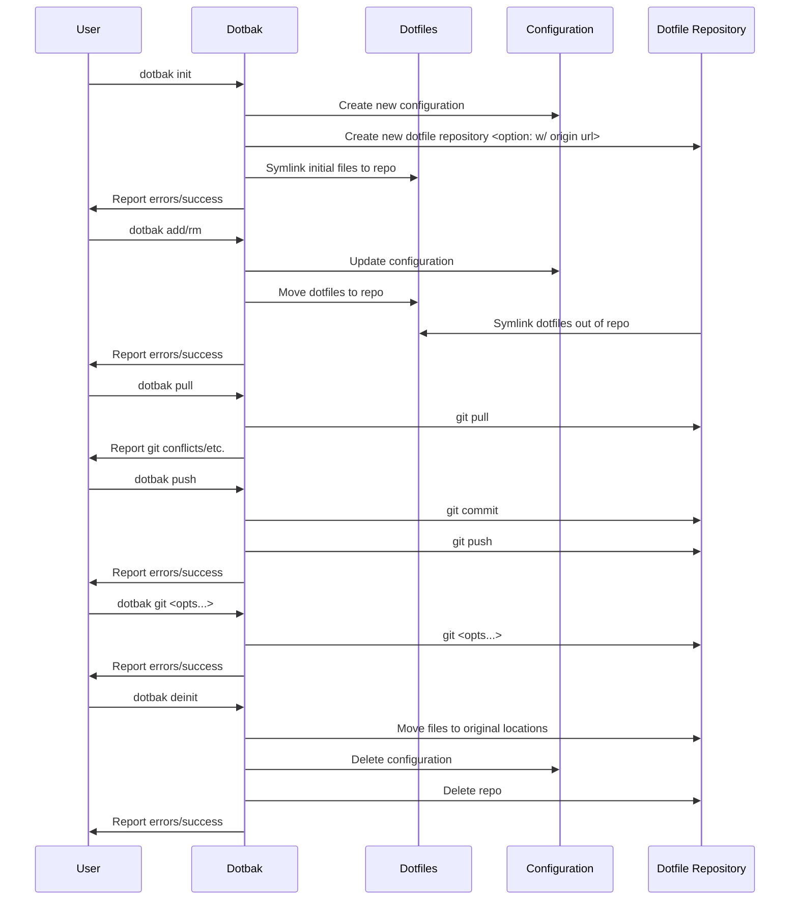

## System block diagram

```mermaid
flowchart LR
    user -- dotbak CLI --> dotbak["dotbak"]
    user -- Text editor --> dotfiles
    user -- Text editor --> conf
    dotbak <-- fs::read/write --> conf["Configuration"]
    dotbak -- libgit2/raw git CLI --> repo["Dotfile git repo"]
    dotfiles["Dotfiles"] <-- Symlink --> repo
```

## Sequence diagram

```mermaid
sequenceDiagram
    participant user as User
    participant dotbak as Dotbak
    participant dfiles as Dotfiles
    participant conf as Configuration
    participant repo as Dotfile Repository

    user ->> dotbak: dotbak init
    dotbak ->> conf: Create new configuration
    dotbak ->> repo: Create new dotfile repository <option: w/ origin url>
    dotbak ->> dfiles: Symlink initial files to repo
    dotbak ->> user: Report errors/success

    user ->> dotbak: dotbak add/rm
    dotbak ->> conf: Update configuration
    dotbak ->> dfiles: Move dotfiles to repo
    repo ->> dfiles: Symlink dotfiles out of repo
    dotbak ->> user: Report errors/success

    user ->> dotbak: dotbak pull
    dotbak ->> repo: git pull
    dotbak ->> user: Report git conflicts/etc.

    user ->> dotbak: dotbak push
    dotbak ->> repo: git commit
    dotbak ->> repo: git push
    dotbak ->> user: Report errors/success

    user ->> dotbak: dotbak git <opts...>
    dotbak ->> repo: git <opts...>
    dotbak ->> user: Report errors/success

    user ->> dotbak: dotbak deinit
    dotbak ->> repo: Move files to original locations
    dotbak ->> conf: Delete configuration
    dotbak ->> repo: Delete repo
    dotbak ->> user: Report errors/success
```
