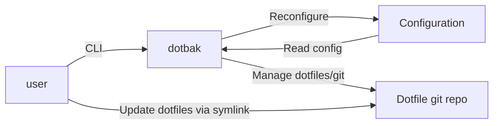

## System block diagram

```mermaid
flowchart LR
    user -- CLI --> dotbak["dotbak"]
    conf["Configuration"] -- Read config --> dotbak
    dotbak -- Reconfigure --> conf
    dotbak -- Manage dotfiles/git --> repo["Dotfile git repo"]
    user -- Update dotfiles via symlink --> repo
```
