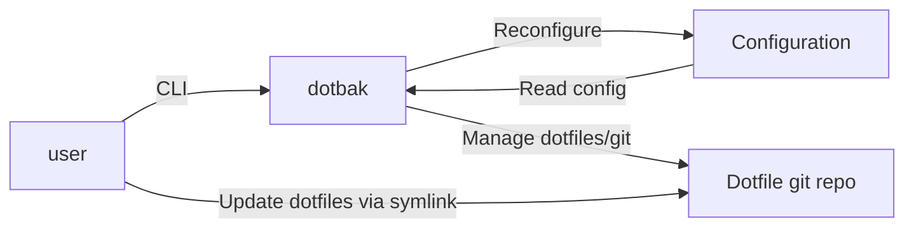

## System block diagram



## Sequence diagram

````mermaid
sequenceDiagram
    participant user as User
    participant dotbak as Dotbak
    participant dfiles as Dotfiles
    participant conf as Configuration
    participant repo as Dotfile Repository

    user ->> dotbak: dotbak init
    dotbak ->> conf: Create new configuration
    dotbak ->> repo: Create new dotfile repository <option: w/ origin url>
    dotbak ->> dfiles: Symlink initial files to repo
    dotbak ->> user: Report errors/success

    user ->> dotbak: dotbak add/rm
    dotbak ->> conf: Update configuration
    dotbak ->> dfiles: Move dotfiles to repo
    repo ->> dfiles: Symlink dotfiles out of repo
    dotbak ->> user: Report errors/success

    user ->> dotbak: dotbak sync
    dotbak ->> repo: git commit
    dotbak ->> repo: git pull
    dotbak ->> user: Report git conflicts/etc.
    dotbak ->> repo: git push
    dotbak ->> user: Report errors/success

    user ->> dotbak: dotbak deinit
    dotbak ->> repo: Move files to original locations
    dotbak ->> conf: Delete configuration
    dotbak ->> user: Report errors/success
```
````
